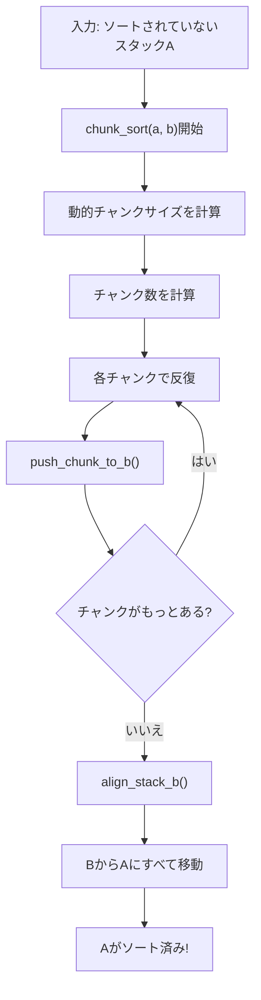

# 📚 Chunk Sort - 深い詳細ドキュメント

**著者:** Javier Pérez Urrutia  
**日付:** 2026-06-12  
**目的:** Chunk Sortアルゴリズムを完全に理解し、レビューで説明できるようにする

---

## 📖 目次

1. [全般的な概要](#全般的な概要)
2. [基本的な概念](#基本的な概念)
3. [データ構造](#データ構造)
4. [各関数の分析](#各関数の分析)
5. [アルゴリズムの完全フロー](#アルゴリズムの完全フロー)
6. [ステップバイステップの例](#ステップバイステップの例)
7. [複雑性とパフォーマンス](#複雑性とパフォーマンス)
8. [使用例](#使用例)

---

## 🎯 全般的な概要

### Chunk Sortとは？

**Chunk Sort**は、入力スタックを**チャンク（セグメント）**に分割するソートアルゴリズムです。チャンクのサイズは要素数に応じて動的に決定されます。

**基本戦略：**

```
1. 配列をチャンクに分割
2. 各チャンクの要素をスタックBに移動
3. Bの最大値を調整
4. すべてをAに戻す（ソート済み）
```

### なぜ有用か？

- **挿入ソートより優れている** 中程度のリスト（100-500要素）
- **基数ソートより簡単** だが効率的
- **適応的**: 入力サイズに応じてチャンクサイズが変わる
- **回転を最小化** 戦略的にBに要素を編成することで

---

## 🔧 基本的な概念

### 1. **チャンク（セグメント）**

チャンクは**正規化されたインデックス**（0からn-1）を等しく分割したものです。

**16要素でchunk_size=4の例:**

```
インデックス:  0  1  2  3  4  5  6  7  8  9 10 11 12 13 14 15
チャンク:    [---- 0 ----][---- 1 ----][---- 2 ----][---- 3 ----]
           チャンク0   チャンク1   チャンク2   チャンク3
```

### 2. **正規化されたインデックス**

すべての値は**0からn-1のインデックス**に正規化されます：

```
入力:        3  1  4  1  5  9  2  6  5  3  5
座標圧縮後:   7  1  9  1 11 15  4  10 11  7 11
再正規化:    2  0  3  0  4  5  1  3  4  2  4
            ↓  ↓  ↓  ↓  ↓  ↓  ↓  ↓  ↓  ↓  ↓
正規化インデックス（0からn-1）
```

### 3. **スタックAとB**

- **スタックA**: メインスタック（初期状態、最終状態）
- **スタックB**: 要素を編成するための補助スタック

```
初期状態:       中間状態:      最終状態:
A: [top]        A: [top]      A: [top]
   2               1             0
   5                             1
   3               B: [top]       2
   0                  2           3
   8                  5           4
                      3           5
                      8           (ソート済み)
```

---

## 📊 データ構造

### `t_node` - 個別ノード

```c
typedef struct s_node
{
	int				value;        // オリジナル値
	int				index;        // 正規化位置（0からn-1）
	struct s_node	*next;         // 次ノードへのポインタ
	struct s_node	*prev;         // 前ノードへのポインタ
}					t_node;
```

### `t_stack` - スタック

```c
typedef struct s_stack
{
	t_node			*top;          // スタックのトップ（操作する場所）
	t_node			*bottom;       // スタックのボトム
	int				size;          // 要素の総数
}					t_stack;
```

### メモリ内の可視化：

```
スタックA:
top -----> [Node: value=5, index=2] -> [Node: value=3, index=0]
                                        -> [Node: value=8, index=4]
                                           -> [Node: value=1, index=1]
                                              -> [Node: value=6, index=3]
                                                 -> NULL
bottom -> [Node: value=6, index=3]

size = 5
```

---

## 🔬 各関数の分析

### **レベル1: メイン関数**

#### `chunk_sort(t_stack *a, t_stack *b)`

**場所:** `chunk_sort.c`

**目的:** Chunk Sortアルゴリズム全体を調整

**疑似コード:**

```
1. 動的なチャンクサイズを取得
2. チャンク数を計算
3. 各チャンクについて:
   - すべての要素をチャンクからBに移動
4. Bの最大値をトップに調整
5. すべてをBからAに移動（ソート済みになります）
```

**コード:**

```c
void	chunk_sort(t_stack *a, t_stack *b)
{
	int	n;
	int	chunk_size;
	int	num_chunks;
	int	chunk_idx;

	if (!a || !b || a->size <= 1)
		return ;
	n = a->size;
	chunk_size = get_dynamic_chunk_size(n);  // ← 適応的に計算
	num_chunks = (n + chunk_size - 1) / chunk_size;  // ← 切り上げ
	chunk_idx = 0;
	while (chunk_idx < num_chunks)
	{
		push_chunk_to_b(a, b, chunk_idx, chunk_size);  // ← チャンクを移動
		chunk_idx++;
	}
	align_stack_b(b);  // ← トップに最大値を配置
	while (b->size > 0)
		pa(a, b);  // ← BからAにすべて移動
}
```

**行ごとの説明:**

```c
// 基本的な検証
if (!a || !b || a->size <= 1)
    return ;  // Aが空または1要素なら、すでにソート済み

// 準備
n = a->size;  // n = 16（例）
chunk_size = get_dynamic_chunk_size(n);  // → 4（以下で説明）
// 計算: (16 + 4 - 1) / 4 = 19 / 4 = 4チャンク（切り上げ）
num_chunks = (n + chunk_size - 1) / chunk_size;

// フェーズ1: すべてのチャンクをBに移動
// イテレーション: chunk_idx = 0, 1, 2, 3
while (chunk_idx < num_chunks)
{
    // 以下で詳しく説明
    push_chunk_to_b(a, b, chunk_idx, chunk_size);
    chunk_idx++;
}

// フェーズ2: Bを調整
// すべてを移動した後、Bはすべての要素を含みます
// ただし、最大値がトップにいる必要があります
align_stack_b(b);

// フェーズ3: BからAに戻す
while (b->size > 0)
    pa(a, b);  // pa = "push a"（BからAのトップに移動）
```

---

### **レベル2: ユーティリティ関数**

#### `get_dynamic_chunk_size(int n)`

**場所:** `chunk_sort_utils.c`

**目的:** 要素数に応じてチャンクの最適サイズを計算

**概念:** より大きなチャンク = より少ない回転数だが比較が多い  
より小さなチャンク = より多くの回転数だが比較が少ない

```c
int	get_dynamic_chunk_size(int n)
{
	if (n <= 20)
		return (4);           // n ≤ 20: 小さなチャンク
	else if (n <= 100)
		return (15);          // 21 ≤ n ≤ 100: 中程度のチャンク
	else if (n <= 500)
		return (30);          // 101 ≤ n ≤ 500: 大きなチャンク
	else
		return (45);          // n > 500: 非常に大きなチャンク
}
```

**参照テーブル:**

| 入力サイズ (n) | チャンクサイズ | チャンク数 | 目的                           |
| -------------- | -------------- | ---------- | ------------------------------ |
| 1-20           | 4              | 最大5      | 非常に小さい、挿入ソートが良い |
| 21-100         | 15             | 最大7      | 小中程度、最適なバランス       |
| 101-500        | 30             | 最大17     | 中程度-大きい                  |
| 500+           | 45             | 11+        | 大きい、反復回数を最小化       |

**なぜこれらの数字？**

- 入力100、chunk_size=15: (100+14)/15 = 7-8チャンク
- 各チャンクは1パスで処理: 7-8 × O(n)操作
- chunk_sizeが50だったら: 2チャンクだけだが各々がより多くの回転を必要

---

#### `count_elements_in_chunk(t_stack *a, int chunk_idx, int chunk_size)`

**場所:** `chunk_sort_utils.c`

**目的:** 特定のチャンク内に何個の要素があるかを数える

```c
int	count_elements_in_chunk(t_stack *a, int chunk_idx, int chunk_size)
{
	t_node	*cur;
	int		lower;
	int		upper;
	int		count;

	// チャンクの範囲を計算
	lower = chunk_idx * chunk_size;        // 範囲の下限
	upper = (chunk_idx + 1) * chunk_size;  // 範囲の上限（除外）
	count = 0;

	// Aのすべてのノードをトラバース
	cur = a->top;
	while (cur)
	{
		// インデックスがチャンク範囲内ならカウント
		if (cur->index >= lower && cur->index < upper)
			count++;
		cur = cur->next;
	}
	return (count);
}
```

**例:**

```
スタックA: [5(idx=2), 3(idx=0), 8(idx=4), 1(idx=1), 6(idx=3)]
chunk_idx = 1, chunk_size = 2

lower = 1 * 2 = 2
upper = 2 * 2 = 4

各ノードをチェック:
- 5: index=2 → 2 >= 2 && 2 < 4? はい → count = 1
- 3: index=0 → 0 >= 2 && 0 < 4? いいえ
- 8: index=4 → 4 >= 2 && 4 < 4? いいえ
- 1: index=1 → 1 >= 2 && 1 < 4? いいえ
- 6: index=3 → 3 >= 2 && 3 < 4? はい → count = 2

戻り値: 2
```

---

#### `find_first_in_chunk_pos(t_stack *a, int lower, int upper)`

**場所:** `chunk_sort_utils.c`

**目的:** インデックス範囲内の最初の要素の位置（トップから）を見つける

```c
int	find_first_in_chunk_pos(t_stack *a, int lower, int upper)
{
	t_node	*cur;
	int		pos;

	cur = a->top;
	pos = 0;
	while (cur)
	{
		// 範囲内の最初の要素の位置を返す
		if (cur->index >= lower && cur->index < upper)
			return (pos);
		cur = cur->next;
		pos++;  // 各ステップで位置をインクリメント
	}
	return (-1);  // 見つからない
}
```

**可視化:**

```
スタックA:
top ────> pos=0 [5, idx=1]
          pos=1 [3, idx=0]
          pos=2 [8, idx=4]  ← 範囲[4,6)で検索
          pos=3 [1, idx=1]
          pos=4 [6, idx=3]

lower = 4, upper = 6

イテレーション1: cur->index = 1 → ？1 in [4,6)? いいえ
イテレーション2: cur->index = 0 → ？0 in [4,6)? いいえ
イテレーション3: cur->index = 4 → ？4 in [4,6)? はい → pos=2を返す
```

---

### **レベル3: 回転関数**

回転は要素を特定の位置に移動させる操作です。

#### `rotate_a_to_pos(t_stack *a, int pos)`

**場所:** `chunk_sort_rotations.c`

**目的:** スタックAを回転させて、位置`pos`の要素をトップに移動

**戦略:**

- `pos <= サイズ/2`の場合: 前方に回転（より効率的）
- `pos > サイズ/2`の場合: 後方に回転（より効率的）

```c
void	rotate_a_to_pos(t_stack *a, int pos)
{
	int	steps;

	if (pos <= 0 || a->size < 2)
		return ;

	// posがスタック上半分（トップに近い）にある場合、前方に回転
	if (pos <= a->size / 2)
	{
		while (pos-- > 0)
			ra(a);  // ra = トップをボトムに移動
	}
	// posがスタック下半分（ボトムに近い）にある場合、後方に回転
	else
	{
		steps = a->size - pos;
		while (steps-- > 0)
			rra(a);  // rra = ボトムをトップに移動
	}
}
```

**可視化例:**

```
ケース1: pos = 2, size = 5 (pos < size/2, 前方に回転)
A: [1, 2, 3, 4, 5]
   0  1  2  3  4

位置2（値3）をトップに移動したい:

ステップ1: ra → [2, 3, 4, 5, 1]  （1回転）
ステップ2: ra → [3, 4, 5, 1, 2]  （2回転） ✓

総回転数: 2 = pos


ケース2: pos = 3, size = 5 (pos > size/2, 後方に回転)
A: [1, 2, 3, 4, 5]
   0  1  2  3  4

位置3（値4）をトップに移動したい:

方法1（前方）: 3 × ra = 3操作
方法2（後方）: (5-3) × rra = 2操作 ← より効率的!

ステップ1: rra → [5, 1, 2, 3, 4]  （1回転）
ステップ2: rra → [4, 5, 1, 2, 3]  （2回転） ✓

総回転数: 2 = 5 - 3 = size - pos
```

**なぜ重要？**

- 各`ra`または`rra`は1操作としてカウント
- 回転を最小化 = 総操作数を最小化
- アルゴリズムは自動的に最短経路を選択

---

#### `rotate_b_to_target(t_stack *b, int target_pos)`

**場所:** `chunk_sort_rotations.c`

**目的:** `rotate_a_to_pos`と同じですがスタックBの場合

```c
void	rotate_b_to_target(t_stack *b, int target_pos)
{
	int	steps;

	if (b->size < 2 || target_pos <= 0)
		return ;

	if (target_pos <= b->size / 2)
	{
		while (target_pos-- > 0)
			rb(b);  // rb = Bを回転
	}
	else
	{
		steps = b->size - target_pos;
		while (steps-- > 0)
			rrb(b);  // rrb = Bを逆回転
	}
}
```

**注記:** ほぼ同じですが、`ra`/`rra`が`rb`/`rrb`に変わります。

---

### **レベル4: アルゴリズムコア関数**

#### `get_best_lower_pos_b(t_stack *b, int idx)`

**場所:** `chunk_sort_core.c`

**目的:** `idx`を持つ要素がBのどの位置に行くべきかを見つける

**戦略:** `idx`より小さい最大の要素をBで見つける

```c
static int	get_best_lower_pos_b(t_stack *b, int idx)
{
	t_node	*cur;
	int		pos;
	int		best_pos;
	int		best_index;

	best_pos = -1;           // まだ見つかっていない
	best_index = -1;         // 見た最低インデックス
	pos = 0;
	cur = b->top;

	while (cur)
	{
		// idxより小さい要素を見つけて、見た中で最も大きい場合
		if (cur->index < idx && cur->index > best_index)
		{
			best_index = cur->index;
			best_pos = pos;
		}
		cur = cur->next;
		pos++;
	}
	return (best_pos);  // 見つからない場合-1、見つかった場合は位置
}
```

**可視化例:**

```
スタックB（トップから下へ）:
top ────> [7]  pos=0
          [5]  pos=1
          [3]  pos=2
          [2]  pos=3

idx=6を持つ要素を挿入したい

探す: "6より小さい中で最大のもの"

トラバース:
- cur->index = 7 → ？7 < 6? いいえ
- cur->index = 5 → ？5 < 6 && 5 > -1? はい → best_index=5, best_pos=1
- cur->index = 3 → ？3 < 6 && 3 > 5? いいえ
- cur->index = 2 → ？2 < 6 && 2 > 5? いいえ

戻り値: best_pos = 1

意味: 要素6はBで要素5の後に行くべき
      これはBを降順で保つ（重要な性質）
```

---

#### `get_max_pos_b(t_stack *b)`

**場所:** `chunk_sort_core.c`

**目的:** Bの最大要素の位置を見つける

```c
static int	get_max_pos_b(t_stack *b)
{
	t_node	*cur;
	int		max_index;
	int		max_pos;
	int		pos;

	max_index = -1;          // 見た最後の最大値
	max_pos = 0;             // 最大値の位置
	pos = 0;
	cur = b->top;

	while (cur)
	{
		// より大きなインデックスを見つけたら更新
		if (cur->index > max_index)
		{
			max_index = cur->index;
			max_pos = pos;
		}
		cur = cur->next;
		pos++;
	}
	return (max_pos);
}
```

**例:**

```
スタックB:
top ────> [3]  pos=0  → max_index = 3, max_pos = 0
          [7]  pos=1  → max_index = 7, max_pos = 1 (更新)
          [5]  pos=2
          [2]  pos=3

戻り値: 1 (7がある位置)
```

---

#### `get_target_position_b(t_stack *b, int idx)`

**場所:** `chunk_sort_core.c`

**目的:** Bに要素を挿入する場所を見つけて順序を保つ

**戦略:**

1. Bが空の場合: 位置0
2. idxより小さい要素がある場合: その要素の後
3. ない場合: 最大値のトップに（ラップアラウンド）

```c
static int	get_target_position_b(t_stack *b, int idx)
{
	int	best_pos;

	if (b->size == 0)
		return (0);  // 最初の要素はトップに

	best_pos = get_best_lower_pos_b(b, idx);

	if (best_pos != -1)
		return (best_pos);  // より小さい要素の後に挿入

	return (get_max_pos_b(b));  // より小さいものがない場合、最大値に
}
```

**なぜこのように？**

Bは「循環的に編成されたリスト」の形を保ちます：

```
例: idx=[7, 5, 3, 1, 9] (最後に9があることに注意)

Bが保つ構造:
top ────> [9] (最大値、一番大きい)
          [7]
          [5]
          [3]
          [1]

idx=8を持つ要素を挿入する場合:
- より小さい要素を探す: 7 < 8がある
- 7の後に挿入

idx=11を持つ要素を挿入する場合:
- より小さい要素を探す: 11より小さいものはない
- トップに（新しい最大値が行く場所）
```

---

#### `align_stack_b(t_stack *b)`

**場所:** `chunk_sort_core.c`

**目的:** Bを回転させて最大値をトップに配置

**なぜ?** 最後にBからAに移動するとき、ソート順で出したい。最大値がトップにいる必要があります。

```c
void	align_stack_b(t_stack *b)
{
	int	max_pos;

	if (b->size < 2)
		return ;

	max_pos = get_max_pos_b(b);      // 最大値がどこにあるか見つける
	rotate_b_to_target(b, max_pos);  // トップに持ってくるように回転
}
```

**ビフォーアフター:**

```
前（push_chunk_to_b後）:
B: [3, 5, 7, 1, 9]  (最大値が位置4にある)

align_stack_b(b) → トップに回転

後:
B: [9, 3, 5, 7, 1]  (最大値がトップにある)
```

---

#### `push_chunk_to_b(t_stack *a, t_stack *b, int c_idx, int c_size)`

**場所:** `chunk_sort_core.c`

**目的:** チャンクのすべての要素をAからBに移動

**これが最も重要な関数です。ステップバイステップで見てみましょう:**

```c
void	push_chunk_to_b(t_stack *a, t_stack *b, int c_idx, int c_size)
{
	int	pos_in_a;
	int	target_pos;
	int	remaining;
	int	lower;
	int	upper;

	// ステップ1: チャンク範囲を計算
	remaining = count_elements_in_chunk(a, c_idx, c_size);  // いくつあるか
	lower = c_idx * c_size;        // 下限
	upper = (c_idx + 1) * c_size;  // 上限

	// ステップ2: チャンク内の各要素を処理
	while (remaining-- > 0)
	{
		// ステップ2a: 次のチャンク要素がどこにあるかを見つける
		pos_in_a = find_first_in_chunk_pos(a, lower, upper);

		// ステップ2b: トップに持ってくるようにAを回転
		rotate_a_to_pos(a, pos_in_a);

		// ステップ2c: Bで順序を保つためにどこに行くべきかを計算
		target_pos = get_target_position_b(b, a->top->index);

		// ステップ2d: 挿入を準備するようにBを回転
		rotate_b_to_target(b, target_pos);

		// ステップ2e: AからBにトップの要素を移動
		pb(a, b);  // pb = B に push（AのトップをBのトップに）
	}
}
```

**ステップバイステップの可視化:**

```
初期状態 (chunk_idx=0, chunk_size=4)
A: [5(idx=2), 3(idx=0), 8(idx=4), 1(idx=1), 6(idx=3)]
B: []

lower = 0, upper = 4
処理する要素: 3(idx=0), 1(idx=1), 5(idx=2), 6(idx=3) [4要素]

═══════════════════════════════════════════════════════════

イテレーション1: remaining = 4
- find_first_in_chunk_pos(A, 0, 4) → 3(idx=0)を位置1で見つける
- rotate_a_to_pos(A, 1) → 3をトップに持ってくるようにAを回転
  A: [3(idx=0), 8(idx=4), 1(idx=1), 6(idx=3), 5(idx=2)]
- get_target_position_b(B, 0) → Bが空、0を返す
- rotate_b_to_target(B, 0) → Bは変わらない（空）
- pb(A, B) → AからBに3を移動
  A: [8(idx=4), 1(idx=1), 6(idx=3), 5(idx=2)]
  B: [3(idx=0)]

═══════════════════════════════════════════════════════════

イテレーション2: remaining = 3
- find_first_in_chunk_pos(A, 0, 4) → 1(idx=1)を位置1で見つける
- rotate_a_to_pos(A, 1) → Aを回転
  A: [1(idx=1), 6(idx=3), 5(idx=2), 8(idx=4)]
- get_target_position_b(B, 1) → 1 > 0、0の位置を返す
  （Bで0の後に挿入: [3, 1]にしたい）
- rotate_b_to_target(B, 0) → Bは既に良い
- pb(A, B)
  A: [6(idx=3), 5(idx=2), 8(idx=4)]
  B: [1(idx=1), 3(idx=0)]

═══════════════════════════════════════════════════════════

イテレーション3: remaining = 2
- find_first_in_chunk_pos(A, 0, 4) → 5(idx=2)を位置1で見つける
- rotate_a_to_pos(A, 1) → Aを回転
  A: [5(idx=2), 8(idx=4), 6(idx=3)]
- get_target_position_b(B, 2) → 2 > 1、1の位置を返す
  （1の後に挿入）
- rotate_b_to_target(B, 1) → Bを1回転
  B: [3(idx=0), 1(idx=1)] → B: [1(idx=1), 3(idx=0)]
- pb(A, B)
  A: [8(idx=4), 6(idx=3)]
  B: [5(idx=2), 1(idx=1), 3(idx=0)]

═══════════════════════════════════════════════════════════

イテレーション4: remaining = 1
- find_first_in_chunk_pos(A, 0, 4) → 6(idx=3)を位置1で見つける
- rotate_a_to_pos(A, 1) → Aを回転
  A: [6(idx=3), 8(idx=4)]
- get_target_position_b(B, 3) → 3 > 2、最大値の位置 = 0
  （トップに挿入、新しい最大値）
- rotate_b_to_target(B, 0) → Bは変わらない
- pb(A, B)
  A: [8(idx=4)]
  B: [6(idx=3), 5(idx=2), 1(idx=1), 3(idx=0)]

═══════════════════════════════════════════════════════════

最終結果:
A: [8(idx=4)]  (他のチャンク要素が残っている)
B: [6(idx=3), 5(idx=2), 1(idx=1), 3(idx=0)]

Bは内部で降順を保ちます (3 < 1 < 5 < 6)
```

---

## 🔄 完全なアルゴリズムフロー

### フローダイアグラム:



### アルゴリズムの段階:

```
フェーズ1: 配布 (各チャンクについてpush_chunk_to_b)
┌─────────────────────────────────────────────┐
│ 入力: A = [5(2), 3(0), 8(4), 1(1), 6(3)]   │
│ chunk_size = 4, num_chunks = 2             │
│                                             │
│ イテレーション1 (チャンク0: idx [0,4))    │
│ 移動: 3(0), 1(1), 5(2), 6(3)              │
│ A → [8(4)]                                 │
│ B → [6(3), 5(2), 1(1), 3(0)]             │
│                                             │
│ イテレーション2 (チャンク1: idx [4,8))   │
│ 移動: 8(4)                                │
│ A → []                                     │
│ B → [8(4), 6(3), 5(2), 1(1), 3(0)]      │
└─────────────────────────────────────────────┘

フェーズ2: 調整
┌─────────────────────────────────────────────┐
│ align_stack_b(b):                          │
│ 最大値(8, pos=0)を見つける                 │
│ 既にトップにあります、回転なし              │
│ B → [8(4), 6(3), 5(2), 1(1), 3(0)]      │
└─────────────────────────────────────────────┘

フェーズ3: 最終的な移動
┌─────────────────────────────────────────────┐
│ while (b->size > 0): pa(a, b)               │
│                                             │
│ pa(): Bから取る、Aに入れる                 │
│ ステップ1: A = [8(4)], B = [6(3), ...]   │
│ ステップ2: A = [6(3), 8(4)], B = [5(2), .]│
│ ステップ3: A = [5(2), 6(3), 8(4)], B = [..]│
│ ステップ4: A = [1(1), 5(2), 6(3), 8(4)], B..│
│ ステップ5: A = [3(0), 1(1), 5(2), 6(3), 8(4)]│
│           (ソート済み!)                    │
└─────────────────────────────────────────────┘
```

---

## 📝 ステップバイステップの例

### 例1: 小さい (n=4)

**入力:** `4 2 1 3`

```
ステップ1: インデックスを正規化（座標圧縮）
入力: 4, 2, 1, 3
ソート済み: 1, 2, 3, 4
マッピング:
  4 → インデックス3
  2 → インデックス1
  1 → インデックス0
  3 → インデックス2

A: [4(idx=3), 2(idx=1), 1(idx=0), 3(idx=2)]

ステップ2: 戦略を決定
size = 4 → "小さい" → insertion_sortを使用（chunk_sortではない）

n <= 20の場合、chunk_sortをスキップしますが、使ったとしたら説明します:

chunk_size = get_dynamic_chunk_size(4) = 4
num_chunks = (4 + 4 - 1) / 4 = 1チャンク

ステップ3: チャンク0 [0, 4)を処理
push_chunk_to_b(a, b, 0, 4):
  処理する要素: 1(0), 2(1), 3(2), 4(3)

  イテレーション1: 1(0)を探す → 位置2 → rotate_a_to_pos(2)
          A: [1(idx=0), 4(idx=3), 2(idx=1), 3(idx=2)]
          target_pos = 0 (Bが空)
          pb() → A: [4(3), 2(1), 3(2)], B: [1(0)]

  イテレーション2: 2(1)を探す → 位置1 → rotate_a_to_pos(1)
          A: [2(idx=1), 3(idx=2), 4(idx=3)]
          target_pos = get_target_position_b(B, 1) = 位置(0) = 0
          pb() → A: [3(2), 4(3)], B: [2(1), 1(0)]

  イテレーション3: 3(2)を探す → 位置0 → 回転なし
          A: [3(idx=2), 4(idx=3)]
          target_pos = get_target_position_b(B, 2) = 位置(1) = 1
          rotate_b_to_target(B, 1) → B: [1(0), 2(1)]
          pb() → A: [4(3)], B: [3(2), 1(0), 2(1)]

  イテレーション4: 4(3)を探す → 位置0 → 回転なし
          A: [4(idx=3)]
          target_pos = get_max_pos_b(B) = 0
          pb() → A: [], B: [4(3), 3(2), 1(0), 2(1)]

ステップ4: align_stack_b
最大値の位置 = 0 (4はすでにトップ)
変化なし

ステップ5: BからAに移動
pa() × 4:
  [1(0)]
  [2(1), 1(0)]
  [3(2), 2(1), 1(0)]
  [4(3), 3(2), 2(1), 1(0)]

オリジナル値: [1, 2, 3, 4] ← ソート済み!
```

---

### 例2: 中程度 (n=8)

**入力:** `7 2 5 1 8 3 6 4`

```
ステップ1: 正規化
入力: 7, 2, 5, 1, 8, 3, 6, 4
マッピング: 1→0, 2→1, 3→2, 4→3, 5→4, 6→5, 7→6, 8→7

A: [7(6), 2(1), 5(4), 1(0), 8(7), 3(2), 6(5), 4(3)]

ステップ2: 戦略
size = 8 ≤ 100 → chunk_size = 4
num_chunks = (8 + 3) / 4 = 2チャンク

ステップ3: チャンク0 [0, 4) - 要素: 1(0), 2(1), 3(2), 4(3)

push_chunk_to_b(a, b, 0, 4):
  Remaining = 4要素

  イテレーション1: 1(0)を探す → 位置3 → rotate_a_to_pos(3)
          7 - 3 = 4ステップ逆方向
          A: [1(0), 7(6), 2(1), 5(4), 8(7), 3(2), 6(5), 4(3)]
          target = 0, pb()
          A: [7(6), 2(1), 5(4), 8(7), 3(2), 6(5), 4(3)]
          B: [1(0)]

  イテレーション2: 2(1)を探す → 位置1 → rotate_a_to_pos(1)
          A: [2(1), 5(4), 8(7), 3(2), 6(5), 4(3), 7(6)]
          target = 位置(0) = 0, pb()
          B: [2(1), 1(0)]

  イテレーション3: 3(2)を探す → 位置3 → rotate_a_to_pos(3)
          A: [3(2), 6(5), 4(3), 7(6), 2(1), 5(4), 8(7)]
          target = 位置(1) = 1, rotate_b_to_target(1)
          B: [1(0), 2(1)] → B: [2(1), 1(0)]
          pb() → B: [3(2), 2(1), 1(0)]

  イテレーション4: 4(3)を探す → 位置2 → rotate_a_to_pos(2)
          A: [4(3), 7(6), 2(1), 5(4), 8(7), 6(5)]
          target = get_max_pos_b(B) = 0, pb()
          B: [4(3), 3(2), 2(1), 1(0)]

チャンク0後の結果:
A: [7(6), 2(1), 5(4), 8(7), 6(5)]
B: [4(3), 3(2), 2(1), 1(0)]

ステップ4: チャンク1 [4, 8) - 要素: 5(4), 6(5), 7(6), 8(7)

push_chunk_to_b(a, b, 1, 4):
  Remaining = 5要素（チャンク内は4）

  イテレーション1: 5(4)を探す → 位置2 → rotate_a_to_pos(2)
          A: [5(4), 8(7), 6(5), 7(6), 2(1)]
          target = get_target_position_b(B, 4) = 位置(3) = 3
          rotate_b_to_target(3)
          B: [4(3), 3(2), 2(1), 1(0)] → [1(0), 4(3), 3(2), 2(1)]
          pb() → B: [5(4), 1(0), 4(3), 3(2), 2(1)]

[続く...]

フェーズ1後の最終結果:
A: []
B: [8(7), 7(6), 6(5), 5(4), 4(3), 3(2), 2(1), 1(0)]

ステップ5: align_stack_b
最大値の位置 = 0 (8がトップ), 変化なし

ステップ6: BからAに移動 (8回のpa())
A: [1(0), 2(1), 3(2), 4(3), 5(4), 6(5), 7(6), 8(7)]

値: [1, 2, 3, 4, 5, 6, 7, 8] ← ソート済み!
```

---

## 📊 複雑性とパフォーマンス

### 時間複雑性の分析

```
操作                          | 複雑性      | 備考
──────────────────────────────┼─────────────┼──────────────────────
get_dynamic_chunk_size()      | O(1)        | 4ケースの検索
count_elements_in_chunk()     | O(n)        | 全Aをトラバース
find_first_in_chunk_pos()     | O(n)        | Aをトラバース（見つけるまで）
get_best_lower_pos_b()        | O(m)        | Bをトラバース (m = Bのサイズ)
get_max_pos_b()               | O(m)        | Bをトラバース
get_target_position_b()       | O(m)        | 関数呼び出し O(m)
rotate_a_to_pos()             | O(回転数)    | 最大n/2回転
rotate_b_to_target()          | O(回転数)    | 最大m/2回転
pb()                          | O(1)        | リンクリスト操作
push_chunk_to_b()             | O(k × n)    | k = チャンク要素数、n = 検索
align_stack_b()               | O(m)        | 1 get_max_pos + 回転
chunk_sort()                  | O(n²)       | 以下の分析を参照
```

### chunk_sort()の詳細分析:

```
フェーズ1: すべてのチャンクを処理
─────────────────────────────────
num_chunks = n / chunk_size

各チャンクについて:
  - count_elements_in_chunk(): O(n)
  - チャンク内の各要素について:
    - find_first_in_chunk_pos(): O(n)
    - rotate_a_to_pos(): 平均O(n/2)
    - get_target_position_b(): 平均O(m/2)
    - rotate_b_to_target(): 平均O(m/2)
    - pb(): O(1)

総要素数: n
総チャンク数: n/chunk_size

複雑性: (n/chunk_size) × n + n × (n/2) = O(n²)

フェーズ2: align_stack_b()
──────────────────────
get_max_pos_b(): O(n)
rotate_b_to_target(): O(n/2)
計: O(n)

フェーズ3: BからAに移動
──────────────────
n × pa(): O(n)

合計: O(n²)
```

### 他のアルゴリズムとの比較

```
アルゴリズム        | 最良 | 平均 | 最悪 | 用途
────────────────────┼──────┼──────┼──────┼──────────
Insertion Sort      | O(n) | O(n²)| O(n²)| n ≤ 100
Chunk Sort          | O(n²)| O(n²)| O(n²)| 100 ≤ n
Radix Sort (LSD)    | O(nk)| O(nk)| O(nk)| n > 500
Quick Sort          | O(nlogn)| O(nlogn)| O(n²)| 無制限

push_swapの場合:
- n ≤ 20: Insertion Sort (O(n²)だが小さい)
- 21 ≤ n ≤ 500: Chunk Sort (最適化されたO(n²))
- n > 500: Radix Sort (O(n)が良い)
```

### 操作数の推定値

```
入力: n = 100, chunk_size = 15

フェーズ1での回転:
- 要素あたりの平均: n/4 ≈ 25
- 総要素数: 100
- 総回転数: 100 × 25 = 2500

align_stack_bでの回転:
- 平均: 50

pb()操作:
- 100操作

pa()操作:
- 100操作

総概算: 2500 + 50 + 200 = 2750操作

基数ソート(kビット、k ≈ 7):
- 概算: 7 × 100 = 700操作

結論: Chunk Sortは基数ソートより3-4倍遅い
しかし理解しやすい。
```

---

## 🎯 使用例

### Chunk Sortを使う時

✅ **使用する場合:**

- 入力: 100-500要素
- 効率より可読性が重要
- アルゴリズムを理解しやすくしたい
- 時間制限がそこまで厳しくない

❌ **使用しない場合:**

- n < 20 → insertion_sortを使用
- n > 500 → radix_sortを使用
- 最大効率が必要
- 入力が非常に大きい

---

## 🔐 重要な不変量

### 1. Bは常に「循環的降順構造」を保つ

```
B = [6(3), 5(2), 1(1), 3(0)] (トップから下へ)

構造: 3 < 1 < 5 < 6 (ボトムから読む)
または: 6 > 5 > 1 だが 1 < 3 (循環)

性質: Xの後に来る全要素はXより小さいインデックス
```

### 2. スタックAは常に有効

```
A = [5, 3, 8, 1, 6]
    トップ = 5
    ボトム = 6
    size = 5
```

### 3. align_stack_b後、最大値がトップ

```
align_stack_b()保証:
- B->top->indexが最大値
- pa()実行時、要素は昇順で出現
```

---

## 💡 レビューのアドバイス

### まずこれを説明:

1. **どんな問題を解く?**
   - 限定操作を使ってスタックをソート

2. **なぜチャンク?**
   - 挿入ソートより比較数を削減
   - ローカリティ: ブロック処理はより効率的

3. **なぜ回転?**
   - 最もトップに近い要素を探すと回転を減らす

4. **アルゴリズムの鍵は?**
   - Bで順序を保ちながら配布
   - 最後に正しく「展開」するため最大値をトップに配置

### これをデモ:

1. 小さい例(n=4): 完全なステップバイステップ
2. 中程度(n=8): チャンクがどう機能するか表示
3. 操作数の違いを表示: vs insertion sort

### これらの質問に答える準備:

- rotate位置 <= size/2の場合、なぜraを使う? → より短い経路
- BはなぜソートされたままなのでUMEL → get_target_position_b()が常に正しい場所を見つけるから
- 重複がある場合どうなる? → アルゴリズムは一意性を仮定（座標圧縮後）
- アルゴリズムは安定? → いいえ。要素同士の相対順序は保たれない（でも重複なし）
- 最後に何回pa()をする? → 正確にn操作、各要素につき1回
- coordinate compressionとは? → 実数を範囲[0, n-1]にマップ

---

## 📌 クイック参照のまとめ

```
┌─────────────────────────────────────────────────────────────┐
│                  CHUNK SORT パイプライン                    │
├─────────────────────────────────────────────────────────────┤
│                                                              │
│  入力: [7, 2, 5, 1, 8, 3, 6, 4]                            │
│    ↓                                                        │
│  [正規化] → [6, 1, 4, 0, 7, 2, 5, 3]                      │
│    ↓                                                        │
│  [chunk_sizeを計算] → 15 (n=8の場合)                      │
│    ↓                                                        │
│  [フェーズ1: チャンク配布]                                 │
│    チャンク0: [0,4) → 4要素をBに移動                       │
│    チャンク1: [4,8) → 4要素をBに移動                       │
│    ↓ 結果: A=[], B=[8(7), 7(6), ..., 1(0)]               │
│    ↓                                                        │
│  [フェーズ2: Bを調整]                                      │
│    最大値(8)位置0で既にトップ ✓                           │
│    ↓ 結果: Bは変わらず                                     │
│    ↓                                                        │
│  [フェーズ3: BからAに移動]                                 │
│    B→A, B→A, ..., B→A (n回)                              │
│    ↓ 結果: A=[1,2,3,4,5,6,7,8]                           │
│    ↓                                                        │
│  出力: [1,2,3,4,5,6,7,8] ✅ ソート済み                    │
│                                                              │
└─────────────────────────────────────────────────────────────┘
```

---

## 🎓 レビュー準備用FAQ

### Q: raとrraの違いは?

**A:** `ra`は前方回転(トップ→ボトム)、`rra`は後方回転(ボトム→トップ)。位置に応じて短い方を使う。

### Q: なぜBは順序を保つ?

**A:** `get_target_position_b()`が常に正しい挿入位置を探す。これが不変量を保つ。

### Q: 重複がある場合?

**A:** アルゴリズムは一意性を仮定（座標圧縮後）。重複は入力段階で検出・拒否される。

### Q: アルゴリズムは安定?

**A:** いいえ。等しい要素の相対順序は保たれない（ただし重複なし）。

### Q: 最後に何個のpa()をする?

**A:** 正確にn回。各要素1回ずつ。

### Q: coordinate compressionとは?

**A:** 実値を[0, n-1]範囲にマップ。アルゴリズムを任意範囲で動作させる。

---

**ドキュメント終了**

push_swapレビュー向けに作成。幸運を! 🚀
