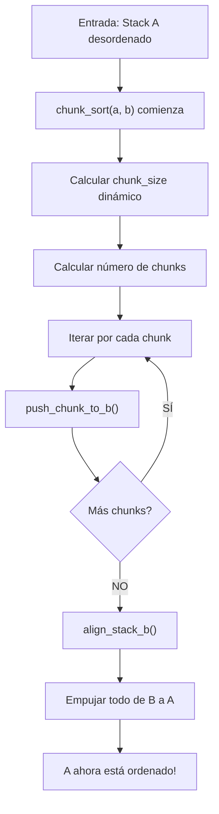

# 📚 Chunk Sort - Documentación Profunda y Detallada

**Autor:** Javier Pérez Urrutia  
**Fecha:** 2026-06-12  
**Propósito:** Entender completamente el algoritmo Chunk Sort para explicarlo en la review

---

## 📖 Tabla de Contenidos

1. [Overview General](#overview-general)
2. [Conceptos Fundamentales](#conceptos-fundamentales)
3. [Estructura de Datos](#estructura-de-datos)
4. [Análisis de Cada Función](#análisis-de-cada-función)
5. [Flujo Completo del Algoritmo](#flujo-completo-del-algoritmo)
6. [Ejemplos Paso a Paso](#ejemplos-paso-a-paso)
7. [Complejidad y Rendimiento](#complejidad-y-rendimiento)
8. [Casos de Uso](#casos-de-uso)

---

## 🎯 Overview General

### ¿Qué es Chunk Sort?

**Chunk Sort** es un algoritmo de ordenamiento que divide la pila de entrada en **chunks (segmentos)** de tamaño variable. El tamaño del chunk se determina dinámicamente según el número de elementos.

**Estrategia general:**

```
1. Dividir array en chunks
2. Empujar elementos de cada chunk a pila B (en orden de chunks)
3. Alinear los máximos en B
4. Empujar todo de vuelta a A ordenado
```

### ¿Por qué es útil?

- **Mejor que insertion sort** para listas medianas (100-500 elementos)
- **Más simple que radix sort** pero más eficiente
- **Adaptativo**: el tamaño del chunk cambia según el tamaño de entrada
- **Minimiza rotaciones** al organizar elementos estratégicamente en B

---

## 🔧 Conceptos Fundamentales

### 1. **Chunks (Segmentos)**

Un chunk es un rango de **índices normalizados** (0 a n-1) dividido en partes iguales.

**Ejemplo con 16 elementos y chunk_size=4:**

```
Índices:    0  1  2  3  4  5  6  7  8  9 10 11 12 13 14 15
Chunks:    [---- 0 ----][---- 1 ----][---- 2 ----][---- 3 ----]
           Chunk 0      Chunk 1      Chunk 2      Chunk 3
```

### 2. **Indexación Normalizada**

Todos los valores se **normalizan a índices** del 0 a n-1:

```
Entrada:    3  1  4  1  5  9  2  6  5  3  5
Después de coordinate compression:
            7  1  9  1 11 15  4  10 11  7 11
Después de renormalizar:
            2  0  3  0  4  5  1  3  4  2  4
            ↓  ↓  ↓  ↓  ↓  ↓  ↓  ↓  ↓  ↓  ↓
Índices normalizados (0 a n-1)
```

### 3. **Stacks A y B**

- **Stack A**: Pila principal (estado inicial, estado final)
- **Stack B**: Pila auxiliar para organizar elementos

```
Estado inicial:       Estado intermedio:      Estado final:
A: [top]              A: [top]                A: [top]
   2                     1                       0
   5                                            1
   3                     B: [top]                2
   0                        2                    3
   8                        5                    4
                            3                    5
                            8                    (ordenada)
```

---

## 📊 Estructura de Datos

### `t_node` - Nodo individual

```c
typedef struct s_node
{
	int				value;        // Valor original
	int				index;        // Posición normalizada (0 a n-1)
	struct s_node	*next;         // Apunta al siguiente nodo
	struct s_node	*prev;         // Apunta al anterior nodo
}					t_node;
```

### `t_stack` - Pila (Stack)

```c
typedef struct s_stack
{
	t_node			*top;          // Tope de la pila (donde hacemos operaciones)
	t_node			*bottom;       // Fondo de la pila
	int				size;          // Número total de elementos
}					t_stack;
```

### Visualización en memoria:

```
Stack A:
top -----> [Node: value=5, index=2] -> [Node: value=3, index=0]
                                        -> [Node: value=8, index=4]
                                           -> [Node: value=1, index=1]
                                              -> [Node: value=6, index=3]
                                                 -> NULL
bottom -> [Node: value=6, index=3]

size = 5
```

---

## 🔬 Análisis de Cada Función

### **NIVEL 1: Función Principal**

#### `chunk_sort(t_stack *a, t_stack *b)`

**Ubicación:** `chunk_sort.c`

**Propósito:** Coordinar todo el algoritmo de chunk sort

**Pseudo-código:**

```
1. Obtener tamaño dinámico del chunk
2. Calcular número de chunks
3. PARA CADA chunk:
   - Empujar todos los elementos del chunk a B
4. Alinear el máximo en B al tope
5. Empujar todo de B a A (quedará ordenado)
```

**Código:**

```c
void	chunk_sort(t_stack *a, t_stack *b)
{
	int	n;
	int	chunk_size;
	int	num_chunks;
	int	chunk_idx;

	if (!a || !b || a->size <= 1)
		return ;
	n = a->size;
	chunk_size = get_dynamic_chunk_size(n);  // ← Calcula tamaño adaptativamente
	num_chunks = (n + chunk_size - 1) / chunk_size;  // ← Redondea hacia arriba
	chunk_idx = 0;
	while (chunk_idx < num_chunks)
	{
		push_chunk_to_b(a, b, chunk_idx, chunk_size);  // ← Empuja un chunk
		chunk_idx++;
	}
	align_stack_b(b);  // ← Alinea máximo en tope
	while (b->size > 0)
		pa(a, b);  // ← Empuja todo de B a A
}
```

**Desglose línea por línea:**

```c
// Validaciones básicas
if (!a || !b || a->size <= 1)
    return ;  // Si A está vacío o tiene 1 elemento, ya está ordenado

// Preparación
n = a->size;  // n = 16 (ejemplo)
chunk_size = get_dynamic_chunk_size(n);  // → 4 (veremos esto abajo)
// Cálculo: (16 + 4 - 1) / 4 = 19 / 4 = 4 chunks (redondeado hacia arriba)
num_chunks = (n + chunk_size - 1) / chunk_size;

// FASE 1: Empujar todos los chunks a B
// Itera: chunk_idx = 0, 1, 2, 3
while (chunk_idx < num_chunks)
{
    // Esto será explicado en detalle abajo
    push_chunk_to_b(a, b, chunk_idx, chunk_size);
    chunk_idx++;
}

// FASE 2: Alinear B
// Después de empujar todo, B contiene todos los elementos
// Pero el máximo debe estar en el tope para que salgan ordenados
align_stack_b(b);

// FASE 3: Devolver a A ordenado
while (b->size > 0)
    pa(a, b);  // pa = "push a" (empuja de B al tope de A)
```

---

### **NIVEL 2: Funciones de Utility**

#### `get_dynamic_chunk_size(int n)`

**Ubicación:** `chunk_sort_utils.c`

**Propósito:** Calcular el tamaño óptimo del chunk según el número de elementos

**La idea:** Chunks más grandes = menos rotaciones pero más comparaciones  
Chunks más pequeños = más rotaciones pero menos comparaciones

```c
int	get_dynamic_chunk_size(int n)
{
	if (n <= 20)
		return (4);           // n ≤ 20: chunks pequeños
	else if (n <= 100)
		return (15);          // 21 ≤ n ≤ 100: chunks medianos
	else if (n <= 500)
		return (30);          // 101 ≤ n ≤ 500: chunks grandes
	else
		return (45);          // n > 500: chunks muy grandes
}
```

**Tabla de referencia:**

| Tamaño entrada (n) | Tamaño chunk | # chunks | Propósito                               |
| ------------------ | ------------ | -------- | --------------------------------------- |
| 1-20               | 4            | hasta 5  | Muy pequeño, insertion sort es mejor    |
| 21-100             | 15           | hasta 7  | Pequeño-mediano, balance óptimo         |
| 101-500            | 30           | hasta 17 | Mediano-grande                          |
| 500+               | 45           | 11+      | Grande, minimizar número de iteraciones |

**¿Por qué estos números?**

- Con entrada de 100 y chunk_size=15: (100+14)/15 = 7-8 chunks
- Cada chunk se procesa en una pasada: 7-8 × O(n) operaciones
- Si chunk_size fuera 50: solo 2 chunks pero cada uno requiere más rotaciones

---

#### `count_elements_in_chunk(t_stack *a, int chunk_idx, int chunk_size)`

**Ubicación:** `chunk_sort_utils.c`

**Propósito:** Contar cuántos elementos están en un chunk específico

```c
int	count_elements_in_chunk(t_stack *a, int chunk_idx, int chunk_size)
{
	t_node	*cur;
	int		lower;
	int		upper;
	int		count;

	// Calcular rangos del chunk
	lower = chunk_idx * chunk_size;        // Límite inferior del rango
	upper = (chunk_idx + 1) * chunk_size;  // Límite superior (exclusivo)
	count = 0;

	// Recorrer todos los nodos en A
	cur = a->top;
	while (cur)
	{
		// Si el índice está en el rango del chunk, contar
		if (cur->index >= lower && cur->index < upper)
			count++;
		cur = cur->next;
	}
	return (count);
}
```

**Ejemplo:**

```
Stack A: [5(idx=2), 3(idx=0), 8(idx=4), 1(idx=1), 6(idx=3)]
chunk_idx = 1, chunk_size = 2

lower = 1 * 2 = 2
upper = 2 * 2 = 4

Chequear cada nodo:
- 5: index=2 → 2 >= 2 && 2 < 4? SÍ → count = 1
- 3: index=0 → 0 >= 2 && 0 < 4? NO
- 8: index=4 → 4 >= 2 && 4 < 4? NO
- 1: index=1 → 1 >= 2 && 1 < 4? NO
- 6: index=3 → 3 >= 2 && 3 < 4? SÍ → count = 2

Retorna: 2
```

---

#### `find_first_in_chunk_pos(t_stack *a, int lower, int upper)`

**Ubicación:** `chunk_sort_utils.c`

**Propósito:** Encontrar la posición (desde el tope) del primer elemento en un rango de índices

```c
int	find_first_in_chunk_pos(t_stack *a, int lower, int upper)
{
	t_node	*cur;
	int		pos;

	cur = a->top;
	pos = 0;
	while (cur)
	{
		// Retornar posición del primer elemento en rango
		if (cur->index >= lower && cur->index < upper)
			return (pos);
		cur = cur->next;
		pos++;  // Incrementar posición con cada paso
	}
	return (-1);  // No encontrado
}
```

**Visualización:**

```
Stack A:
top ────> pos=0 [5, idx=1]
          pos=1 [3, idx=0]
          pos=2 [8, idx=4]  ← Buscando en rango [4,6)
          pos=3 [1, idx=1]
          pos=4 [6, idx=3]

lower = 4, upper = 6

Iteración 1: cur->index = 1 → ¿1 in [4,6)? NO
Iteración 2: cur->index = 0 → ¿0 in [4,6)? NO
Iteración 3: cur->index = 4 → ¿4 in [4,6)? SÍ → return pos=2
```

---

### **NIVEL 3: Funciones de Rotación**

Las rotaciones son operaciones que mueven el tope a una posición específica.

#### `rotate_a_to_pos(t_stack *a, int pos)`

**Ubicación:** `chunk_sort_rotations.c`

**Propósito:** Rotar stack A hasta que el elemento en posición `pos` llegue al tope

**Estrategia:**

- Si `pos <= tamaño/2`: rotar hacia adelante (más eficiente)
- Si `pos > tamaño/2`: rotar hacia atrás (más eficiente)

```c
void	rotate_a_to_pos(t_stack *a, int pos)
{
	int	steps;

	if (pos <= 0 || a->size < 2)
		return ;

	// Si pos está en la mitad superior (más cerca del tope), rotar hacia adelante
	if (pos <= a->size / 2)
	{
		while (pos-- > 0)
			ra(a);  // ra = rotate a: mueve tope al final
	}
	// Si pos está en la mitad inferior (más cerca del final), rotar hacia atrás
	else
	{
		steps = a->size - pos;
		while (steps-- > 0)
			rra(a);  // rra = reverse rotate a: mueve final al tope
	}
}
```

**Ejemplo visual:**

```
CASO 1: pos = 2, size = 5 (pos < size/2, rotar adelante)
A: [1, 2, 3, 4, 5]
   0  1  2  3  4

Queremos que el elemento en pos=2 (valor 3) llegue al tope:

Paso 1: ra → [2, 3, 4, 5, 1]  (1 rotación)
Paso 2: ra → [3, 4, 5, 1, 2]  (2 rotaciones) ✓

total rotaciones: 2 = pos


CASO 2: pos = 3, size = 5 (pos > size/2, rotar atrás)
A: [1, 2, 3, 4, 5]
   0  1  2  3  4

Queremos que el elemento en pos=3 (valor 4) llegue al tope:

Método 1 (adelante): 3 × ra = 3 operaciones
Método 2 (atrás):    (5-3) × rra = 2 operaciones ← Más eficiente!

Paso 1: rra → [5, 1, 2, 3, 4]  (1 rotación)
Paso 2: rra → [4, 5, 1, 2, 3]  (2 rotaciones) ✓

total rotaciones: 2 = 5 - 3 = size - pos
```

**Por qué esto es importante:**

- Cada `ra` o `rra` cuenta como 1 operación
- Minimizar rotaciones = minimizar operaciones totales
- Algoritmo elige automáticamente el camino más corto

---

#### `rotate_b_to_target(t_stack *b, int target_pos)`

**Ubicación:** `chunk_sort_rotations.c`

**Propósito:** Idéntico a `rotate_a_to_pos` pero para stack B

```c
void	rotate_b_to_target(t_stack *b, int target_pos)
{
	int	steps;

	if (b->size < 2 || target_pos <= 0)
		return ;

	if (target_pos <= b->size / 2)
	{
		while (target_pos-- > 0)
			rb(b);  // rb = rotate b
	}
	else
	{
		steps = b->size - target_pos;
		while (steps-- > 0)
			rrb(b);  // rrb = reverse rotate b
	}
}
```

**Nota:** Es casi idéntica, solo cambia `ra`/`rra` por `rb`/`rrb`.

---

### **NIVEL 4: Funciones Core del Algoritmo**

#### `get_best_lower_pos_b(t_stack *b, int idx)`

**Ubicación:** `chunk_sort_core.c`

**Propósito:** Encontrar la posición en B donde un elemento con `idx` debe ir

**Estrategia:** Encontrar el elemento más grande en B que sea menor que `idx`

```c
static int	get_best_lower_pos_b(t_stack *b, int idx)
{
	t_node	*cur;
	int		pos;
	int		best_pos;
	int		best_index;

	best_pos = -1;           // No encontrado aún
	best_index = -1;         // Índice más bajo visto
	pos = 0;
	cur = b->top;

	while (cur)
	{
		// Si encontramos un elemento menor que idx y es el mayor visto
		if (cur->index < idx && cur->index > best_index)
		{
			best_index = cur->index;
			best_pos = pos;
		}
		cur = cur->next;
		pos++;
	}
	return (best_pos);  // -1 si no hay ninguno, posición si sí
}
```

**Ejemplo visual:**

```
Stack B (tope a abajo):
top ────> [7]  pos=0
          [5]  pos=1
          [3]  pos=2
          [2]  pos=3

Queremos insertar elemento con idx=6

Buscamos: "el mayor que sea menor que 6"

Recorrido:
- cur->index = 7 → ¿7 < 6? NO
- cur->index = 5 → ¿5 < 6 && 5 > -1? SÍ → best_index=5, best_pos=1
- cur->index = 3 → ¿3 < 6 && 3 > 5? NO
- cur->index = 2 → ¿2 < 6 && 2 > 5? NO

Retorna: best_pos = 1

Significado: El elemento 6 debería ir después del elemento 5 en B
             Esto mantiene B en orden descendente (es una propiedad importante)
```

---

#### `get_max_pos_b(t_stack *b)`

**Ubicación:** `chunk_sort_core.c`

**Propósito:** Encontrar la posición del elemento máximo en B

```c
static int	get_max_pos_b(t_stack *b)
{
	t_node	*cur;
	int		max_index;
	int		max_pos;
	int		pos;

	max_index = -1;          // Último máximo visto
	max_pos = 0;             // Posición del máximo
	pos = 0;
	cur = b->top;

	while (cur)
	{
		// Si encontramos un índice mayor, actualizar
		if (cur->index > max_index)
		{
			max_index = cur->index;
			max_pos = pos;
		}
		cur = cur->next;
		pos++;
	}
	return (max_pos);
}
```

**Ejemplo:**

```
Stack B:
top ────> [3]  pos=0  → max_index = 3, max_pos = 0
          [7]  pos=1  → max_index = 7, max_pos = 1 (actualizado)
          [5]  pos=2
          [2]  pos=3

Retorna: 1 (posición donde está el 7)
```

---

#### `get_target_position_b(t_stack *b, int idx)`

**Ubicación:** `chunk_sort_core.c`

**Propósito:** Encontrar dónde insertar un elemento en B manteniendo orden

**Estrategia:**

1. Si B está vacío: posición 0
2. Si hay un elemento menor que idx: posición después de ese elemento
3. Si NO hay: ir al tope del máximo (envolver alrededor)

```c
static int	get_target_position_b(t_stack *b, int idx)
{
	int	best_pos;

	if (b->size == 0)
		return (0);  // Primer elemento va al tope

	best_pos = get_best_lower_pos_b(b, idx);

	if (best_pos != -1)
		return (best_pos);  // Insertar después del elemento menor

	return (get_max_pos_b(b));  // Si no hay menor, ir al máximo
}
```

**¿Por qué es así?**

B se mantiene en forma de "lista organizada cíclicamente":

```
Ejemplo: idx=[7, 5, 3, 1, 9] (notar el 9 al final)

B mantiene estructura:
top ────> [9] (máximo, más grande)
          [7]
          [5]
          [3]
          [1]

Si insertar elemento con idx=8:
- Buscar menor: hay 7 < 8
- Insertar después de 7

Si insertar elemento con idx=11:
- Buscar menor: no hay ninguno < 11
- Ir al tope (máximo), que sería donde va un "nuevo máximo"
```

---

#### `align_stack_b(t_stack *b)`

**Ubicación:** `chunk_sort_core.c`

**Propósito:** Rotar B para que el máximo esté en el tope

**¿Por qué?** Cuando empujamos de B a A al final, queremos que salgan en orden. El máximo debe estar en el tope.

```c
void	align_stack_b(t_stack *b)
{
	int	max_pos;

	if (b->size < 2)
		return ;

	max_pos = get_max_pos_b(b);      // Encontrar dónde está el máximo
	rotate_b_to_target(b, max_pos);  // Rotar para llevarlo al tope
}
```

**Antes y después:**

```
ANTES (después de push_chunk_to_b):
B: [3, 5, 7, 1, 9]  (máximo en pos=4)

align_stack_b(b) → Rotar al tope

DESPUÉS:
B: [9, 3, 5, 7, 1]  (máximo en tope)
```

---

#### `push_chunk_to_b(t_stack *a, t_stack *b, int c_idx, int c_size)`

**Ubicación:** `chunk_sort_core.c`

**Propósito:** Empujar TODOS los elementos de un chunk de A a B

**Esta es la función más importante. Veámosla paso a paso:**

```c
void	push_chunk_to_b(t_stack *a, t_stack *b, int c_idx, int c_size)
{
	int	pos_in_a;
	int	target_pos;
	int	remaining;
	int	lower;
	int	upper;

	// Paso 1: Calcular rango del chunk
	remaining = count_elements_in_chunk(a, c_idx, c_size);  // Cuántos hay
	lower = c_idx * c_size;        // Límite inferior
	upper = (c_idx + 1) * c_size;  // Límite superior

	// Paso 2: Procesar cada elemento del chunk
	while (remaining-- > 0)
	{
		// Paso 2a: Encontrar dónde está el siguiente elemento del chunk
		pos_in_a = find_first_in_chunk_pos(a, lower, upper);

		// Paso 2b: Rotar A para llevarlo al tope
		rotate_a_to_pos(a, pos_in_a);

		// Paso 2c: Calcular dónde debe ir en B (para mantener orden)
		target_pos = get_target_position_b(b, a->top->index);

		// Paso 2d: Rotar B para preparar la inserción
		rotate_b_to_target(b, target_pos);

		// Paso 2e: Empujar el elemento de A a B
		pb(a, b);  // pb = push b (toma tope de A, lo pone en tope de B)
	}
}
```

**Flujo visual paso a paso:**

```
ESTADO INICIAL (chunk_idx=0, chunk_size=4)
A: [5(idx=2), 3(idx=0), 8(idx=4), 1(idx=1), 6(idx=3)]
B: []

lower = 0, upper = 4
Elementos a procesar: 3(idx=0), 1(idx=1), 5(idx=2), 6(idx=3) [4 elementos]

═══════════════════════════════════════════════════════════

ITERACIÓN 1: remaining = 4
- find_first_in_chunk_pos(A, 0, 4) → encuentra 3(idx=0) en pos=1
- rotate_a_to_pos(A, 1) → Rotar A para llevar 3 al tope
  A: [3(idx=0), 8(idx=4), 1(idx=1), 6(idx=3), 5(idx=2)]
- get_target_position_b(B, 0) → B vacío, retorna 0
- rotate_b_to_target(B, 0) → B no cambia (vacío)
- pb(A, B) → Empujar 3 de A a B
  A: [8(idx=4), 1(idx=1), 6(idx=3), 5(idx=2)]
  B: [3(idx=0)]

═══════════════════════════════════════════════════════════

ITERACIÓN 2: remaining = 3
- find_first_in_chunk_pos(A, 0, 4) → encuentra 1(idx=1) en pos=1
- rotate_a_to_pos(A, 1) → Rotar A
  A: [1(idx=1), 6(idx=3), 5(idx=2), 8(idx=4)]
- get_target_position_b(B, 1) → 1 > 0, retorna pos de 0 = 0
  (Insertar después de 0: queremos [3, 1] en B)
- rotate_b_to_target(B, 0) → B ya está bien
- pb(A, B)
  A: [6(idx=3), 5(idx=2), 8(idx=4)]
  B: [1(idx=1), 3(idx=0)]

═══════════════════════════════════════════════════════════

ITERACIÓN 3: remaining = 2
- find_first_in_chunk_pos(A, 0, 4) → encuentra 5(idx=2) en pos=1
- rotate_a_to_pos(A, 1) → Rotar A
  A: [5(idx=2), 8(idx=4), 6(idx=3)]
- get_target_position_b(B, 2) → 2 > 1, pos de 1 = 1
  (Insertar después de 1: queremos [3, 1] → algún lugar)
- rotate_b_to_target(B, 1) → Rotar B una vez
  B: [3(idx=0), 1(idx=1)]  → B: [1(idx=1), 3(idx=0)]
- pb(A, B)
  A: [8(idx=4), 6(idx=3)]
  B: [5(idx=2), 1(idx=1), 3(idx=0)]

═══════════════════════════════════════════════════════════

ITERACIÓN 4: remaining = 1
- find_first_in_chunk_pos(A, 0, 4) → encuentra 6(idx=3) en pos=1
- rotate_a_to_pos(A, 1) → Rotar A
  A: [6(idx=3), 8(idx=4)]
- get_target_position_b(B, 3) → 3 > 2, buscar max = pos 0
  (Insertar en tope, nuevo máximo)
- rotate_b_to_target(B, 0) → B no cambia
- pb(A, B)
  A: [8(idx=4)]
  B: [6(idx=3), 5(idx=2), 1(idx=1), 3(idx=0)]

═══════════════════════════════════════════════════════════

RESULTADO FINAL:
A: [8(idx=4)]  (quedan elementos de otros chunks)
B: [6(idx=3), 5(idx=2), 1(idx=1), 3(idx=0)]

B mantiene orden descendente internamente (3 < 1 < 5 < 6)
```

---

## 🔄 Flujo Completo del Algoritmo

### Diagrama de flujo general:



### Fases del algoritmo:

```
FASE 1: DISTRIBUCIÓN (push_chunk_to_b para cada chunk)
┌─────────────────────────────────────────────┐
│ Entrada: A = [5(2), 3(0), 8(4), 1(1), 6(3)]│
│ chunk_size = 4, num_chunks = 2             │
│                                             │
│ ITERACIÓN 1 (Chunk 0: idx [0,4))           │
│ Empujar: 3(0), 1(1), 5(2), 6(3)            │
│ A → [8(4)]                                  │
│ B → [6(3), 5(2), 1(1), 3(0)]              │
│                                             │
│ ITERACIÓN 2 (Chunk 1: idx [4,8))           │
│ Empujar: 8(4)                              │
│ A → []                                      │
│ B → [8(4), 6(3), 5(2), 1(1), 3(0)]       │
└─────────────────────────────────────────────┘

FASE 2: ALINEACIÓN
┌─────────────────────────────────────────────┐
│ align_stack_b(b):                          │
│ Encontrar máximo (8, pos=0)                 │
│ Ya está en tope, sin rotaciones             │
│ B → [8(4), 6(3), 5(2), 1(1), 3(0)]       │
└─────────────────────────────────────────────┘

FASE 3: EMPUJE FINAL
┌─────────────────────────────────────────────┐
│ while (b->size > 0): pa(a, b)               │
│                                             │
│ pa(): toma de B, pone en A                  │
│ Paso 1: A = [8(4)], B = [6(3), ...]       │
│ Paso 2: A = [6(3), 8(4)], B = [5(2), ...] │
│ Paso 3: A = [5(2), 6(3), 8(4)], B = [...] │
│ Paso 4: A = [1(1), 5(2), 6(3), 8(4)], B.. │
│ Paso 5: A = [3(0), 1(1), 5(2), 6(3), 8(4)]│
│           (¡ORDENADO!)                      │
└─────────────────────────────────────────────┘
```

---

## 📝 Ejemplos Paso a Paso

### Ejemplo 1: Pequeño (n=4)

**Entrada:** `4 2 1 3`

```
PASO 1: Normalizar índices (coordinate compression)
Entrada: 4, 2, 1, 3
Ordenado: 1, 2, 3, 4
Mapeo:
  4 → índice 3
  2 → índice 1
  1 → índice 0
  3 → índice 2

A: [4(idx=3), 2(idx=1), 1(idx=0), 3(idx=2)]

PASO 2: Determinar estrategia
size = 4 → "pequeño" → usa insertion_sort (no chunk_sort)

El chunk_sort se salta para n <= 20, pero explicaremos como si lo usara:

chunk_size = get_dynamic_chunk_size(4) = 4
num_chunks = (4 + 4 - 1) / 4 = 1 chunk

PASO 3: Procesar Chunk 0 [0, 4)
push_chunk_to_b(a, b, 0, 4):
  Elementos a procesar: 1(0), 2(1), 3(2), 4(3)

  Iter 1: Buscar 1(0) → pos=2 → rotate_a_to_pos(2)
          A: [1(idx=0), 4(idx=3), 2(idx=1), 3(idx=2)]
          target_pos = 0 (B vacío)
          pb() → A: [4(3), 2(1), 3(2)], B: [1(0)]

  Iter 2: Buscar 2(1) → pos=1 → rotate_a_to_pos(1)
          A: [2(idx=1), 3(idx=2), 4(idx=3)]
          target_pos = get_target_position_b(B, 1) = pos(0) = 0
          pb() → A: [3(2), 4(3)], B: [2(1), 1(0)]

  Iter 3: Buscar 3(2) → pos=0 → no rotar
          A: [3(idx=2), 4(idx=3)]
          target_pos = get_target_position_b(B, 2) = pos(1) = 1
          rotate_b_to_target(B, 1) → B: [1(0), 2(1)]
          pb() → A: [4(3)], B: [3(2), 1(0), 2(1)]

  Iter 4: Buscar 4(3) → pos=0 → no rotar
          A: [4(idx=3)]
          target_pos = get_max_pos_b(B) = 0
          pb() → A: [], B: [4(3), 3(2), 1(0), 2(1)]

PASO 4: align_stack_b
max_pos = 0 (4 ya está en tope)
No cambios

PASO 5: Empujar de B a A
pa() × 4:
  [1(0)]
  [2(1), 1(0)]
  [3(2), 2(1), 1(0)]
  [4(3), 3(2), 2(1), 1(0)]

Valores originales: [1, 2, 3, 4] ← ¡ORDENADO!
```

---

### Ejemplo 2: Mediano (n=8)

**Entrada:** `7 2 5 1 8 3 6 4`

```
PASO 1: Normalizar
Entrada: 7, 2, 5, 1, 8, 3, 6, 4
Mapeo:  1→0, 2→1, 3→2, 4→3, 5→4, 6→5, 7→6, 8→7

A: [7(6), 2(1), 5(4), 1(0), 8(7), 3(2), 6(5), 4(3)]

PASO 2: Estrategia
size = 8 ≤ 100 → chunk_size = 4
num_chunks = (8 + 3) / 4 = 2 chunks

PASO 3: CHUNK 0 [0, 4) - Elementos: 1(0), 2(1), 3(2), 4(3)

push_chunk_to_b(a, b, 0, 4):
  Remaining = 4 elementos

  Iter 1: find 1(0) → pos=3 → rotate_a_to_pos(3)
          7 - 3 = 4 pasos atrás
          A: [1(0), 7(6), 2(1), 5(4), 8(7), 3(2), 6(5), 4(3)]
          target = 0, pb()
          A: [7(6), 2(1), 5(4), 8(7), 3(2), 6(5), 4(3)]
          B: [1(0)]

  Iter 2: find 2(1) → pos=1 → rotate_a_to_pos(1)
          A: [2(1), 5(4), 8(7), 3(2), 6(5), 4(3), 7(6)]
          target = pos(0) = 0, pb()
          B: [2(1), 1(0)]

  Iter 3: find 3(2) → pos=3 → rotate_a_to_pos(3)
          A: [3(2), 6(5), 4(3), 7(6), 2(1), 5(4), 8(7)]
          target = pos(1) = 1, rotate_b_to_target(1)
          B: [1(0), 2(1)] → B: [2(1), 1(0)]
          pb() → B: [3(2), 2(1), 1(0)]

  Iter 4: find 4(3) → pos=2 → rotate_a_to_pos(2)
          A: [4(3), 7(6), 2(1), 5(4), 8(7), 6(5)]
          target = get_max_pos_b(B) = 0, pb()
          B: [4(3), 3(2), 2(1), 1(0)]

Resultado después Chunk 0:
A: [7(6), 2(1), 5(4), 8(7), 6(5)]
B: [4(3), 3(2), 2(1), 1(0)]

PASO 4: CHUNK 1 [4, 8) - Elementos: 5(4), 6(5), 7(6), 8(7)

push_chunk_to_b(a, b, 1, 4):
  Remaining = 5 elementos (pero solo 4 del chunk)

  Iter 1: find 5(4) → pos=2 → rotate_a_to_pos(2)
          A: [5(4), 8(7), 6(5), 7(6), 2(1)]
          target = get_target_position_b(B, 4) = pos(3) = 3
          rotate_b_to_target(3)
          B: [4(3), 3(2), 2(1), 1(0)] → [1(0), 4(3), 3(2), 2(1)]
          pb() → B: [5(4), 1(0), 4(3), 3(2), 2(1)]

[continuaría...]

Resultado final después Phase 1:
A: []
B: [8(7), 7(6), 6(5), 5(4), 4(3), 3(2), 2(1), 1(0)]

PASO 5: align_stack_b
max_pos = 0 (8 en tope), sin cambios

PASO 6: Empujar de B a A (8 pa())
A: [1(0), 2(1), 3(2), 4(3), 5(4), 6(5), 7(6), 8(7)]

Valores: [1, 2, 3, 4, 5, 6, 7, 8] ← ¡ORDENADO!
```

---

## 📊 Complejidad y Rendimiento

### Análisis de Complejidad

#### Complejidad Temporal

```
OPERACIÓN                    | COMPLEJIDAD | NOTAS
─────────────────────────────┼─────────────┼──────────────────────────
get_dynamic_chunk_size()     | O(1)        | Búsqueda en 4 casos
count_elements_in_chunk()    | O(n)        | Recorre todo A
find_first_in_chunk_pos()    | O(n)        | Recorre A hasta encontrar
get_best_lower_pos_b()       | O(m)        | Recorre B (m = tamaño B)
get_max_pos_b()              | O(m)        | Recorre B
get_target_position_b()      | O(m)        | Llamadas a funciones O(m)
rotate_a_to_pos()            | O(rotaciones)| hasta n/2 rotaciones
rotate_b_to_target()         | O(rotaciones)| hasta m/2 rotaciones
pb()                         | O(1)        | Operación en lista enlazada
push_chunk_to_b()            | O(k × n)    | k = elementos chunk, n búsqueda
align_stack_b()              | O(m)        | 1 get_max_pos + rotaciones
chunk_sort()                 | O(n²)       | Ver análisis abajo
```

#### Análisis detallado de chunk_sort():

```
Fase 1: Procesar todos los chunks
─────────────────────────────────────
num_chunks = n / chunk_size

Para CADA chunk:
  - count_elements_in_chunk(): O(n)
  - Para CADA elemento en el chunk:
    - find_first_in_chunk_pos(): O(n)
    - rotate_a_to_pos(): O(n/2) en promedio
    - get_target_position_b(): O(m/2) en promedio
    - rotate_b_to_target(): O(m/2) en promedio
    - pb(): O(1)

Total elementos: n
Total chunks: n/chunk_size

Complexity: (n/chunk_size) × n + n × (n/2) = O(n²)

Fase 2: align_stack_b()
─────────────────────────
get_max_pos_b(): O(n)
rotate_b_to_target(): O(n/2)
Total: O(n)

Fase 3: Empujar de B a A
──────────────────────
n × pa(): O(n)

TOTAL: O(n²)
```

### Comparación con otros algoritmos

```
ALGORITMO           | MEJOR CASO | PROMEDIO  | PEOR CASO | DATOS
────────────────────┼────────────┼───────────┼───────────┼──────────
Insertion Sort      | O(n)       | O(n²)     | O(n²)     | n ≤ 100
Chunk Sort          | O(n²)      | O(n²)     | O(n²)     | 100 ≤ n
Radix Sort (LSD)    | O(nk)      | O(nk)     | O(nk)     | n > 500
Quick Sort          | O(n log n) | O(n log n)| O(n²)     | Sin límite

Para push_swap:
- n ≤ 20: Insertion Sort (O(n²) pero pequeño)
- 21 ≤ n ≤ 500: Chunk Sort (O(n²) pero optimizado)
- n > 500: Radix Sort (O(n) mejor)
```

### Número de operaciones (estimado)

```
Entrada: n = 100, chunk_size = 15

ROTACIONES en Fase 1:
- Promedio por elemento: n/4 ≈ 25
- Total elementos: 100
- Total rotaciones: 100 × 25 = 2500

ROTACIONES en align_stack_b:
- En promedio: 50

EMPUJES pb:
- 100 operaciones

EMPUJES pa:
- 100 operaciones

TOTAL APROXIMADO: 2500 + 50 + 200 = 2750 operaciones

Con radix sort de k bits (k ≈ 7):
- Aproximado: 7 × 100 = 700 operaciones

Conclusión: Chunk sort es 3-4× más lento que radix sort
pero mucho más simple de entender.
```

---

## 🎯 Casos de Uso

### Cuándo usar Chunk Sort

✅ **USAR cuando:**

- Entrada: 100-500 elementos
- Necesitas legibilidad sobre eficiencia
- Quieres entender el algoritmo fácilmente
- No tienes límite de tiempo muy estricto

❌ **NO USAR cuando:**

- n < 20 → Usar insertion_sort
- n > 500 → Usar radix_sort
- Necesitas máxima eficiencia
- Tienes entrada muy grande

---

## 🔐 Invariantes Importantes

### 1. B siempre mantiene estructura "descendente cíclica"

```
Si B = [6(3), 5(2), 1(1), 3(0)] en tope a abajo

Estructura: 3 < 1 < 5 < 6 (cuando lees desde abajo)
O: 6 > 5 > 1 pero 1 < 3 (ciclo)

Propiedad: Todos los elementos que vienen después de X
           tienen índice menor que X
```

### 2. Stack A siempre es válido (es una pila)

```
Si A = [5, 3, 8, 1, 6]
    tope = 5
    fondo = 6
    size = 5
```

### 3. Después de alinear B, máximo en tope

```
align_stack_b() garantiza que después:
- B->top->index es el máximo
- Cuando hacemos pa(), los elementos salen en orden ascendente
```

---

## 💡 Consejos para la Review

### Explica esto primero:

1. **¿Qué problema resuelve?**
   - Ordenar pilas usando operaciones limitadas

2. **¿Por qué chunks?**
   - Reduce número de comparaciones vs insertion sort
   - Localidad: procesar en bloques es más eficiente

3. **¿Por qué rotar?**
   - Buscar elemento más cercano al tope reduce rotaciones

4. **¿Cuál es la clave del algoritmo?**
   - Mantener B en orden mientras distribuimos
   - Alinear máximo al final para "desenrollar" correctamente

### Demuestra esto con ejemplos:

1. Pequeño ejemplo (n=4): paso a paso completo
2. Mediano (n=8): mostrar cómo funcionan chunks
3. Mostrar diferencia en número de operaciones vs insertion sort

### Responde estas preguntas:

- ¿Qué pasa si haces chunk_size = 1? → Insertion sort
- ¿Qué pasa si haces chunk_size = n? → Todo de una vez, muchas rotaciones
- ¿Por qué chunk_size cambia con n? → Balance entre rotaciones y iteraciones
- ¿Cuál es el peor caso? → Cuando todos elementos están al revés
- ¿Cuál es el mejor caso? → Cuando ya están ordenados (pero no lo detectamos)

---

## 📌 Resumen Visual Rápido

```
┌─────────────────────────────────────────────────────────────┐
│                    CHUNK SORT PIPELINE                      │
├─────────────────────────────────────────────────────────────┤
│                                                              │
│  ENTRADA: [7, 2, 5, 1, 8, 3, 6, 4]                         │
│    ↓                                                        │
│  [Normalizar] → [6, 1, 4, 0, 7, 2, 5, 3]                  │
│    ↓                                                        │
│  [Calcular chunk_size] → 15 (para n=8)                    │
│    ↓                                                        │
│  [Fase 1: Distribuir chunks]                               │
│    Chunk 0: [0,4) → Empujar 4 elementos a B               │
│    Chunk 1: [4,8) → Empujar 4 elementos a B               │
│    ↓ Resultado: A=[], B=[8(7), 7(6), ..., 1(0)]           │
│    ↓                                                        │
│  [Fase 2: Alinear B]                                       │
│    Máximo (8) ya en tope ✓                                 │
│    ↓ Resultado: B sin cambios                              │
│    ↓                                                        │
│  [Fase 3: Empujar de B a A]                                │
│    B→A, B→A, ..., B→A (n veces)                           │
│    ↓ Resultado: A=[1,2,3,4,5,6,7,8]                      │
│    ↓                                                        │
│  SALIDA: [1,2,3,4,5,6,7,8] ✅ ORDENADO                    │
│                                                              │
└─────────────────────────────────────────────────────────────┘
```

---

## 🎓 Preguntas Frecuentes para Preparar la Review

### P: ¿Qué diferencia hay entre ra y rra?

**R:** `ra` rota hacia adelante (tope → fondo), `rra` rota hacia atrás (fondo → tope). Usamos la más corta según la posición.

### P: ¿Por qué B se mantiene en orden?

**R:** La función `get_target_position_b()` busca siempre el lugar correcto donde insertar un elemento. Esto mantiene la estructura invariante.

### P: ¿Qué pasa si tenemos duplicados?

**R:** El algoritmo asume valores únicos (después de coordinate compression). Los duplicados en entrada se detectan y rechazan antes.

### P: ¿Es estable el algoritmo?

**R:** NO es estable. El orden relativo de elementos iguales no se preserva (pero no hay iguales después de normalizar).

### P: ¿Cuántos pa() se hacen al final?

**R:** Exactamente `n` operaciones `pa()`, una por cada elemento en B.

### P: ¿Qué es coordinate compression?

**R:** Mapear valores reales a rangos [0, n-1]. Hace que el algoritmo funcione con cualquier rango de números.

---

**FIN DE LA DOCUMENTACIÓN**

Elaborado para la review de push_swap. ¡Buena suerte! 🚀
